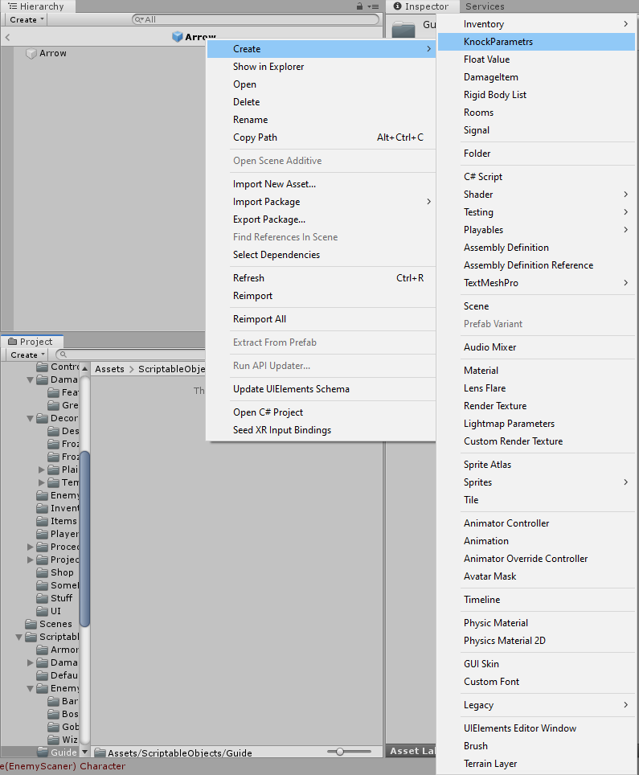
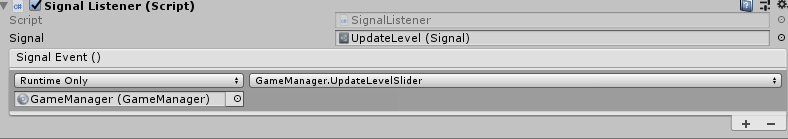

# Вспомогательные системы

 Данные системы сильно упрощают работу с данными, что положительно сказывается на процессе разработки. В данном разделе будут описаны две системы. ScriptableObjects  и SignalSystem

## Scriptable objects  
 Для хранения данных иногда недостаточно встроеных в компонент перменных, тогда на помощь приходит атрибут класса [ScriptableObject]. Он позволяет создавать класс, используемый для хранения данных, это позволяет упростить изменение параметров в процессе работы программы.
 Каждый новый класс требует отдельный класс. Например, для класса, хранящего int и класса хранящего массив int нужны разные рализации.

### Реализация
Представим базовый код для лучшего пониманя. Создадим класс для хранения перменных типа float. Добавим возможность создания файла, использующего созданный класс.
```C#
[CreateAssetMenu(fileName = "New params", menuName = "KnockParametrs")]
public class DefaultKnock : ScriptableObject
{
    public float Damage;
    public float WaitTime;
    public float KnockTime;
    public float Thrust;
}
```
Первая строка отвечает за создание файла на основе данного класса, наследование от ScriptableObjects позволяет объектам храниться без изменений.

### Использоание
После сохранения созданного класса, можно его использовать.
Создадим в проводнике файл типа DefaultKnock


Готово, файл создан. Прикрепим его в качесте переменной к другому классу.

Все поля этого класса используются как и обычно

```C#
DefaultKnock knock;
float dmg = knock.Damage;
float th = knock.Thrust;
```

### В чем смысл?

На первый взягляд различий с базовой схемой хранения данных в классах незаметно. Возникает вопрос, зачем создавть целый отдельный класс и хранить его? Ответ достаточно прост: ScriptableObject помогает снизить объём занимаемой памяти и позволяет разделить архитектуру кода

## Signal System

Система, основанная на ScriptableObjects позволяет сосздавать пользовательские Event'ы и реагировать на них.

### Реализация

Необходимо создать 2 класса, которые будут неразрывно связаны:

Signal.cs
```C#
[CreateAssetMenu]
public class Signal : ScriptableObject
{
    public List<SignalListener> Listeners = new List<SignalListener>();

    public void Raise()
    {
        for (int i = Listeners.Count - 1; i >= 0; i--)
        {
            Listeners[i].OnSignalRaised();
        }
    }
    public void RegisterListener(SignalListener Listener)
    {
        Listeners.Add(Listener);
    }

    public void DeRegisterListener(SignalListener Listener)
    {
        Listeners.Remove(Listener);
    }
}
```

SignalListener.cs

```C#
public class SignalListener : MonoBehaviour
{

    public Signal Signal;
    public UnityEvent SignalEvent;
    public void OnSignalRaised()
    {
        SignalEvent.Invoke();
    }

    private void OnEnable()
    {
        Signal.RegisterListener(this);
    }

    private void OnDisable()
    {
        Signal.DeRegisterListener(this);
    }
}
```

### Изспользование

Для начала создадим обычный Signal, как это сделать было описано выше. Далее "прикрепим" скрипт SignalListener.cs к любому активному объекту, далее "прикрепим" к нему и сам сигнал.



Следующим шагом, необходимо выбрать исполняемый метод при активации сигнала. В нашем случае это `GameManager.UpdateLevelSlider()`

Вуаля. При исполнении метода `UdateLevel.Raise()` вызовется `GameManager.UpdateLevelSlider()`
