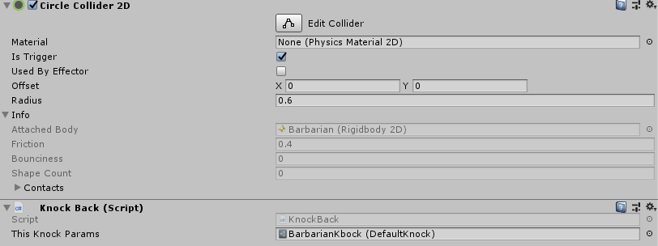
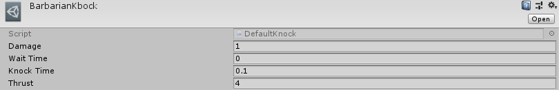

# Персонажи в игре

Перед ознакомление с данным разделом необходимо знать про реализовнные [вспомогательные системы](/AdditionalSystems.md).

## Игрок

Объект игрок представлен совокупностью компонент:
- Твердое тело
- Два коллайдера, отвечающие за физическое взаимодействие со средой и за получение урона
- Скрипт поведения персонажа
- Аниматор
- Сканер противников

### Основной скрипт
[Данный скрипт](Assets/Scripts/Player/PlayerManager.cs) позволяет задать скорость передвижения персонажа(Movement speed), а также привязать такие компоненты как:
- Scriptable object здоровья персонажа (Там указанно максимальое здоровье)
- Scriptable object количества брони (Аналогично с бронёй)
- UI объект, появляющийся при получении урона

Остальные обЪекты никак не влияют на характеристики персонажа.

### Сканер противников
Отвечает за помощь в стрельбе для игрока. Он определяет ближайшего к игроку доступного противника и передает его позицию игроку.

## Враждебные персонажи

Все [враждебные персонажи](Assets/Scripts/Enemy/Enemy.cs) делятся на 3 типа:
- Melee (Противники ближнего боя);
- Range (Противники дальнего боя);
- Боссы (Гибриды с уникальными механиками);

## Противники ближнего боя

[Данный тип](Assets/Scripts/Enemy/Melee.cs) противников атакует лишь на небольшом расстоянии. Как только игрок попал в его зону видимости или атаковал, происходит рывок к игроку.
Основной скрипт предоставляет следующие поля для модернизации:
- Скорость передвижения
- Задержка между атаками
- Время анимации атаки
- Объект генерирующийся при смерти и количество этих объектов
- Радиус обнаружения
- Радиус атаки

Также существует [дополнительный скрипт](Assets/Scripts/Damage/KnockBack.cs), отвечающий за нанесение урона.
Его удобно хранить в дочернем объекте самого противника. Сам скрипт требует существования коллайдера, наносящего урон. Также целесообразно связать появление этого коллайдра с анимацией атаки.
Скрипт хранит Scriptable Object отвечающий за парметры урона и отброса игрока, которому нанесен урон.

Данный объект позволяет изменить:
- Наносимый урон
- Задержку
- Время отброса
- Силу отброса

Для поддержания специфики класса, следует делать радиус атаки как можно меньше, а урон как можно выше.

## Противники дальнего боя

[Противники](Assets/Scripts/Enemy/Range.cs), атакующие на расстоянии, предварительно проработанными объектами(Prefabs/ProjectTiles). Имеют более сложную схему пермещения, а именно как только игрок попал в зону видимости, проверяет на возможность попать по нему, если нет, то совершается действие, для обхода препятствия. Основной скрипт предоставляет следующие параметры для изменения:
- Скорость передвижения
- Пауза между атаками
- Время анимации атаками
- Объект генерирующийся при смерти и количество этих объектов
- Радиус обнаружения
- Радиус атаки
- Объект, которым производится атака

На последнем пункте остановимся подробнее. Для корректной работы игры, объект должен содержать компонент твердое тело, колайдер и управляющий скрипт. В нашем случае 2 скрипта. Один отвечает за нанесение урона, другой за взаимодействие с окружением.
В данной схеме для нанесения урона используется тот же скрипт, что и у противника ближнего боя.

## Боссы

Боссы - это комплексный класс, в котором используются как механики ближнего, так и дальнего боя. Для каждого босса предполагается написание отдельного скрипта. Так что и реализация будет отличаться. В общем виде босс представлен комбинацией двух вышеперечисленных скриптов с большим уроном и количеством здоровья.
