# Создание используемого предмета

## Цель
Создать предмет полностью восстанавливающий жизни.
Необходимо:
- Реалищовать скрипт полного восстановления жизней
- Создать иконку этого предмета

## Ша за шагом

Для начала создадим объект типа item

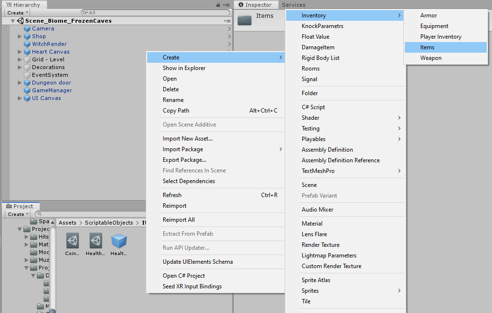

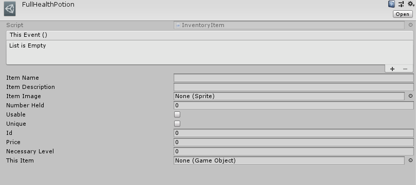

Зададим для него все основные поля:
- Название
- Описание
- Цена
- Иконка
- Необходимый уровень

Выставим атрибут Usable. ID пока оставим без изменений

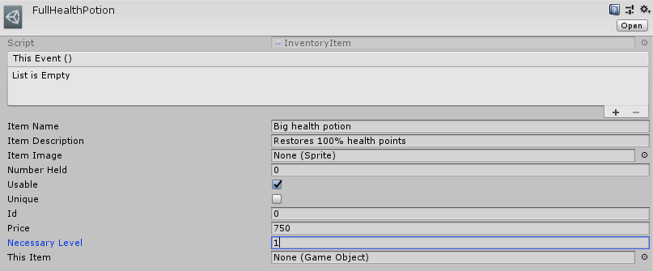

Добавим предмет в список всех предметов. Запомним его порядковый номер. В нашем случае это 6. Его и впишем в поле ID

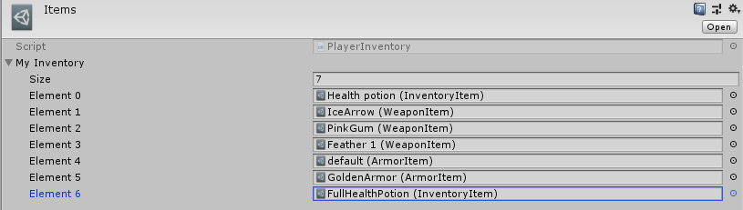

### Скрипт взаимодействия

Перейдем к более интересной части. Необходимо указать что будет происходить при использовании предмета. Это и сделаем. Необходимо создать скрипт с названием сходным или близким к названиб предмета и реализовать там изменение количества жизней игрока.

```C#
public class FullHealthPotion : MonoBehaviour
{
    public void OnUse()
    {
        PlayerManager player = GameObject.FindGameObjectWithTag("Player").GetComponent<PlayerManager>();
        player.CurrentHealth.RuntimeValue = player.CurrentHealth.InitialValue;
        player.PlayerHealthSignal.Raise();
    }
}
```

Далее создадим Empty Game Object, к которому и прикрепим написанный выше скрипт.

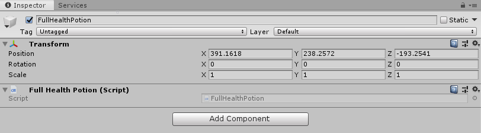

Сохраним созданный объект как Prefab, просто перетащив его (drag and drop) в рабочую папку.

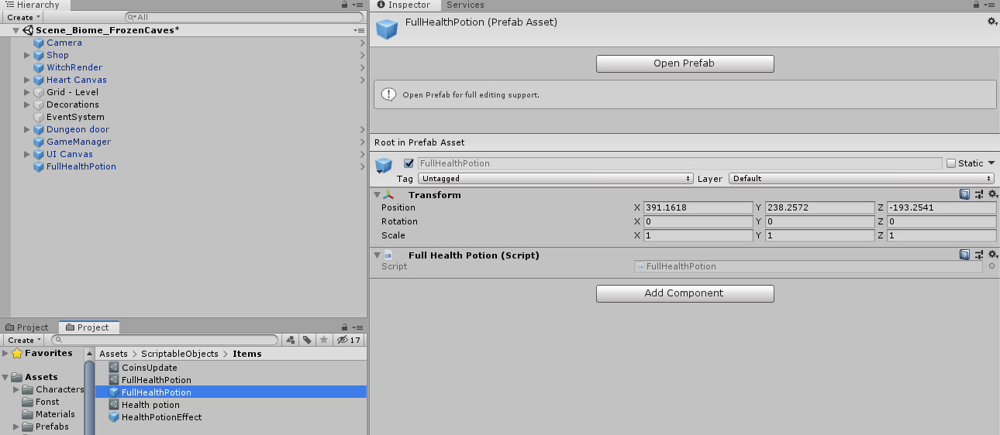

Созданный префаб прикрепим к нашему объекту и вызовем там реализлванную выше функцию.

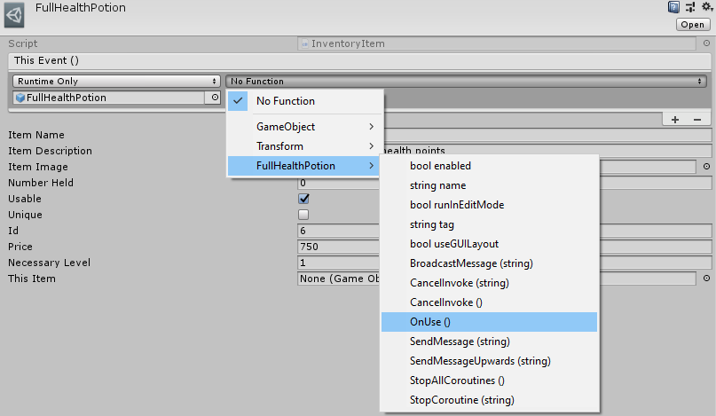

Создание предмета завершено. Переходим к тестированию.

## Проверка работспособности

Добавим созданный предмет к стандартному списку магазина.

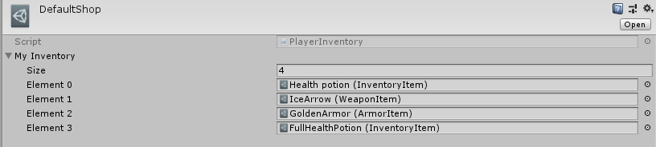

Перейдем к игре и проверим корректность отображаемого контента.

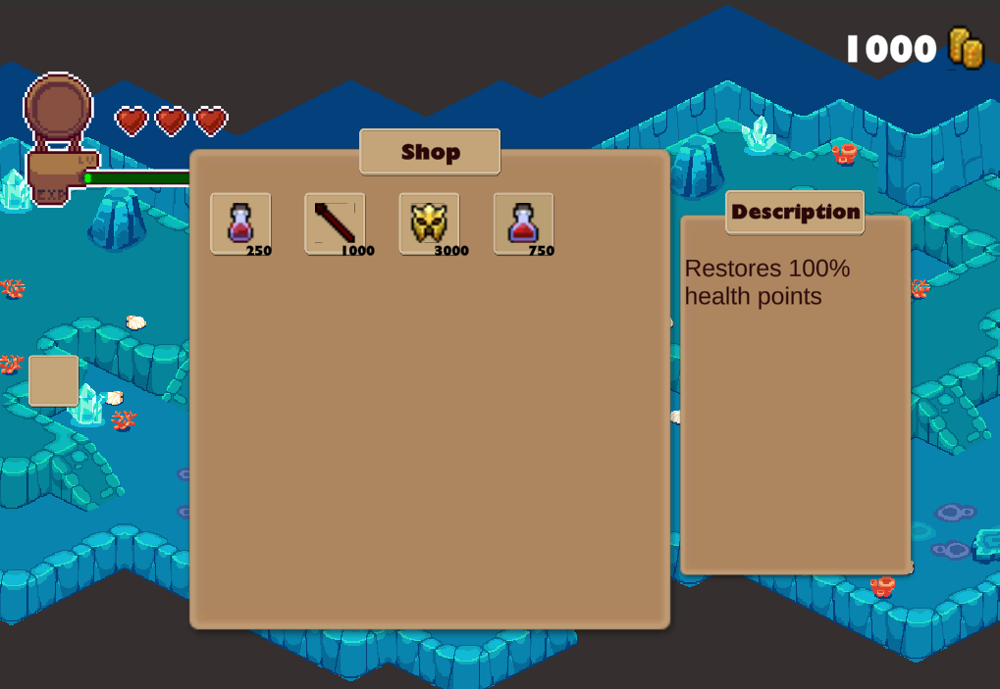

Все отображается корректно. Осуществляем покупку предмета.

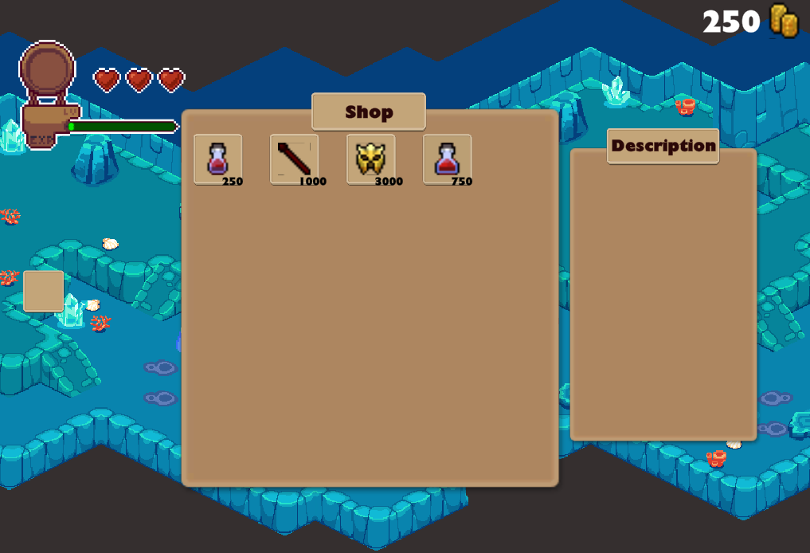

Покупка предмета прошла успешно. Предмет сохранился в магазине и появился в инвентаре в количестве 1 штуки.

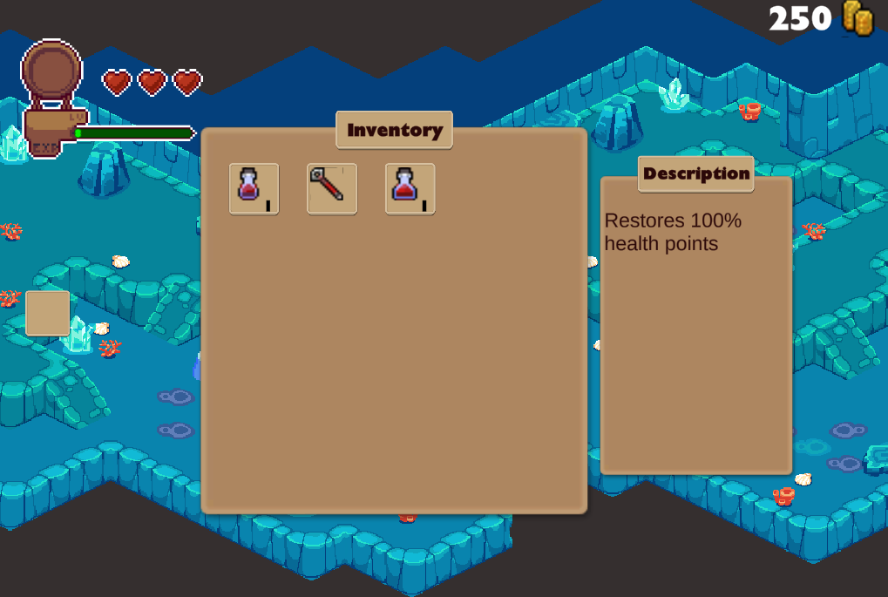

Заключительная проверка работспособности:

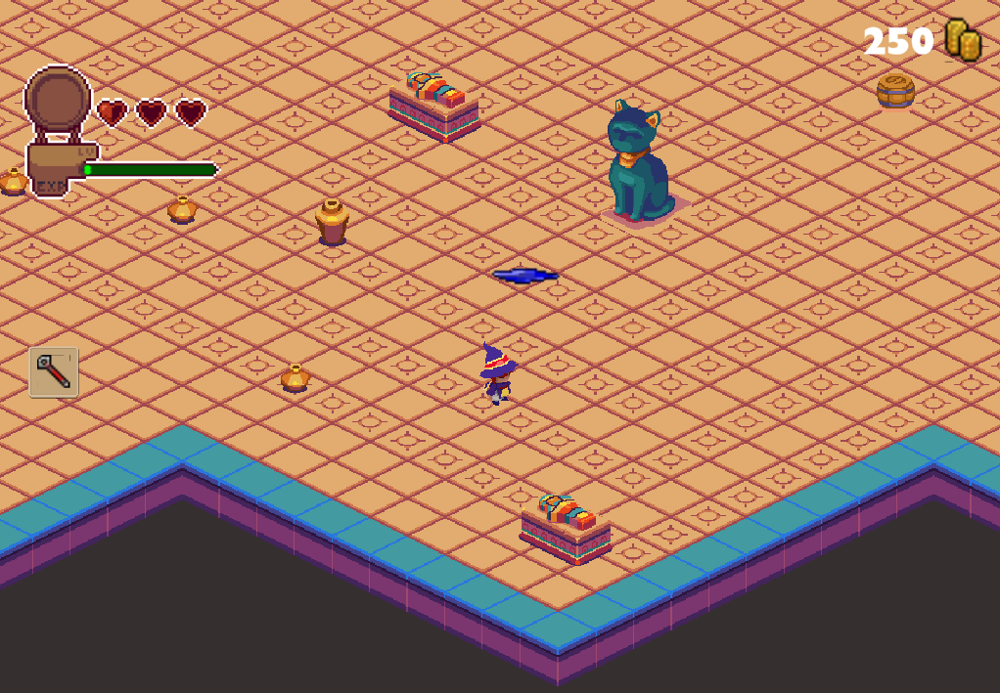

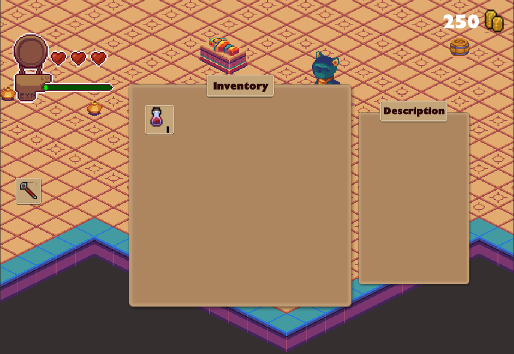

Жизни были полностью восстановлены, а значит проверка успешно пройдена.
Если возникнут проблемы с сохранением и загрузкой, следует проверить наличие предмета в общем списке предметов и соответствие его ID, его порядковому номеру.
