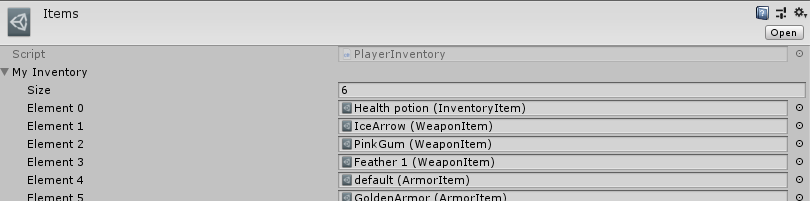

# Предметы, инвентарь, магазин и т.д

Перед ознакомлением с данным разделом необходимо знать про реализовнные [вспомогательные системы](/AdditionalSystems.md).

## Предметы

Лучшем способом реализации предметов в RPG игре, явлется выше описанные Scriptable Objects. Так у обычного предмета заданы следующие поля:
- Название
- Описание
- Иконка
- Используемый или нет
- Уникальный или нет
- ID (порядковый номер в общем списке предметов)
- Цена в магазине (если продажа не планируется, то 0)
- Необходимый для покупки\использования уровень
- Ссылка на Prefab самого объека (если это оружие)
- Метод, активируемый при использовании

### Оружие

Является наследуемым классом от класса item. Дополнительно содержит в себе параметры самого оружия и метод, который добавит это оружие в селлектор при его использовании в инвентаре.

### Броня

Является наследуемым классом от класса item. Дополнительно содержит в себе количество брони и метод, который наденет эту броню взамен старой.

Оружие и броню следует делать уникальным и используемым, далее будет объяснено зачем.

## Инвентарь

Инвентарь явлется UI элементом, с сеткой для предметов и панелью описания предметов.
Для его реализации был создан ScriptableObject PlayerInventory содержащий в себе список предметов.
Он был использоан как текущий инвентарь игрока, общий список всех предметов в игре и список предметов в магазине.

Объект типа PLayerInventory помещается в класс InventoryManager, где тот преобразуется в UI

Пример инвентаря игрока. Все уникальные объеты могут быть использованны только один раз и не имеют количества

Предметы, которые были помечены как Usable могут быть использованны при нажатии. При наведении курсора на предмет появится его описание в соответствующем меню.

## Магазин

Аналог инвентаря, реализованный по тому же принципу. В свою очередь магазин имеет несколько отличий:
- Открывается только в домашней локации у специального места
- Имеет заблокированные предметы
- Списывает деньги за покупку. После покупки все предметы отправляются в инвентарь

Unique предметы в магазине могут быть куплены лишь единожды.

## Рекомендации

- Оружие и броню помечайте как Unique и Usable, чтобы иметь только олну копию и дать возможность ее использовать
- Не забывайте добавлять предметы в общий спсиок предметов и присваивать им ID как порядковый номер в массиве

Как создать свой предметь можно почитать в соответствующем [разделе](/MakingItem.md)
