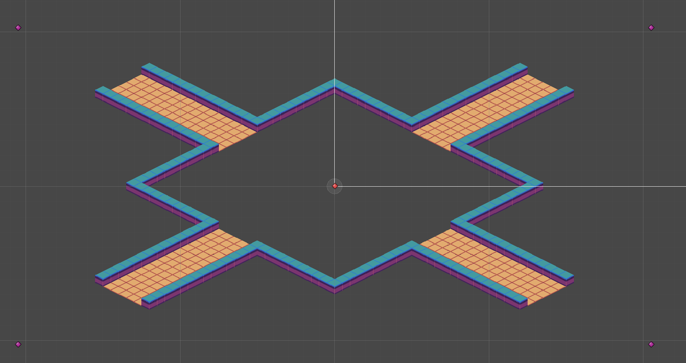
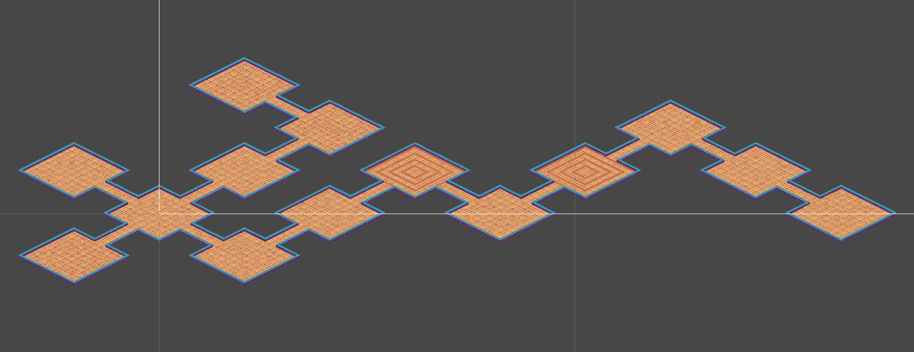
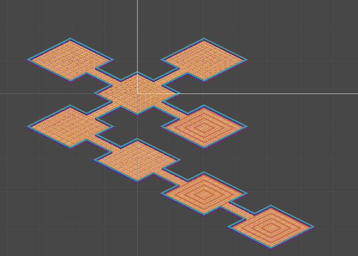
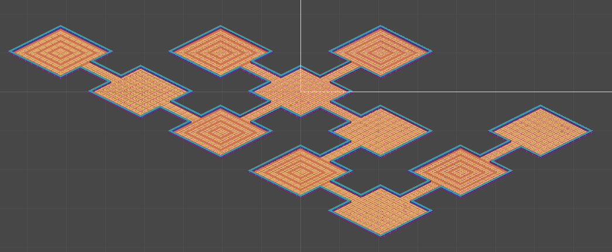
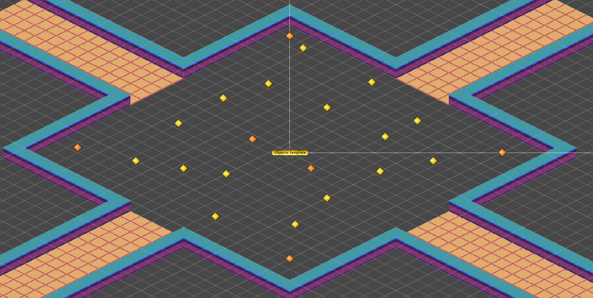
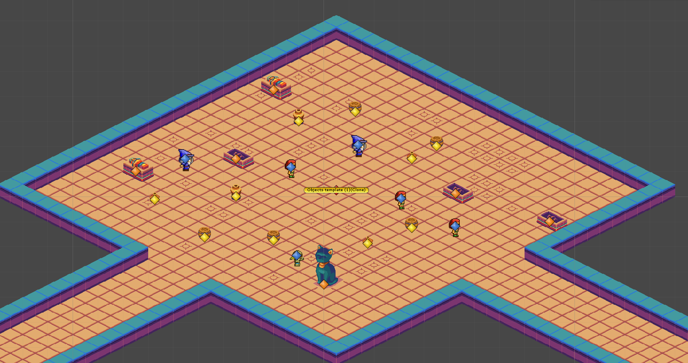
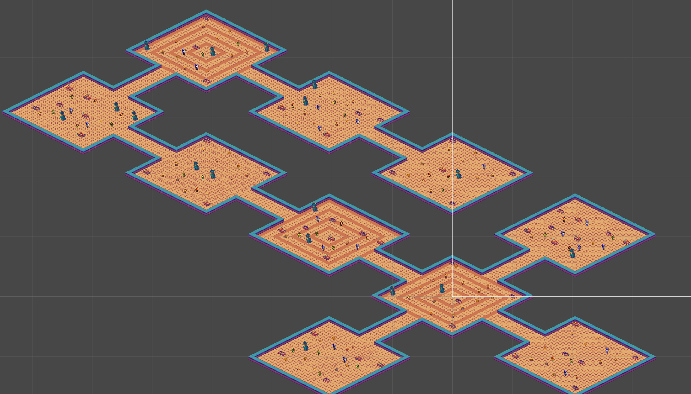

# Процедурная генерация

Важнейшей частью созданной игры, является процедурная генерация подземелий. Рассмотри подробнее процесс создания этой системы.

## Как это работает

Рассмотрим генерацию комнат в отдельности(без создания интерьера и противников). Каждая комната имеет 1 или 2 выхода, стартовая комната имеет 4 выхода. На определенном расстоянии от каждого выхода расположены объекты(фиолетовый цвет на скриншоте) отвечающие за генерацию следующей комнаты. В центре комнаты расположен специальный объект Destroyer(красный цвет на скриншоте), о нем позже.

Аналогичным образом спроектированны все остальные комнаты. Верхний, левый, нижний и правый объект являются различными, в них содержится скрипт процедурной генерации, далее будем называть эти объекты точками генерации.

Так, левой точке генерации разрешено генерировать толлько комнаты с правыми выходами, т.е не одну комнату, а 3 (право-лево, право-низ, право-верх, право), аналогично и для остальных точек генерации. Каждая точка генерирует только одну комнату, но и тут есть условия, так, например если точка готовиться сгенерировать комнату, а на ее месте сгенерированна комната, то новая на ее месте сгенерированна не будет.

Все комнаты генерируются с задержкой в 0.1 секунды, что позволяет избежать неконтролируемого процесса. Ниже приведены примеры генерации.

### Destroyer

Данный объект уничтожет любую точку генерации, которая окажется около него. Это позволяет избежать появления комнать друг-в-друге.

## Углубимся в детали

Комнаты готовы, но не хватает декораций и противников.
В произовольном порядке расставим точки генерации по комнате и каждой точке передадим список объектов для генерации. Получим систему точек. Таки же образом создадим еще несколько систем.

Далее просто при появлении комнаты, выбираем случайную систему, в которой для каждой точки будет случайно выбираться объект.

## Результат

