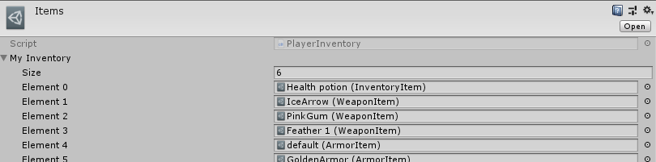

# Система сохранений
Система реализванна в [следующей директории](Assets/Scripts/SaveLoadSystem)

Для хранения данных используется конвертации данных в бинарный файл и обратно.
Список переменных подлжежащих сохранению:
- Текущее здоровье
- Максимальное здоровье
- Звезды
- Броня и ее ID
- Уровень
- Список оружия
- Инвентарь
- Предметы в магазине

## Список всех предметов

Для корректной и удобной работы системы сохранения был реализован список всех предметов в игре, из которого удобно выбрать необходимые и распределить между инвентарем и магазином.

## Конвертация в бинарный файл и хранение
Конвертация осуществлена за счет встроенных в Unity средств. Она позволяет сделать файл менее читаемым, дабы избежвть внесение изменений в данные. Хранение файла сохранения производится локально в характерной для Unity папке `Application.persistentDataPath`, что обеспечивает постоянную доступность этого файла для программы и отсутствие ошибок.

## Когда производится сохранение

Игра сохраняется автоматически при каждом входе в подземелье и выходе из него или смерти, также доступно пользовательское сохранение во время нахождение в домашней локации. В подземелье запрещено пользовательское сохранение. Загрузка доступна только во время нахождение в домашней локации и на начальном экране.

## Сброс сохранения

Доступна функция сборса сохранения она возвращает все данные на начальный уровень `SaveLoadActions.ResetDefaults()`
